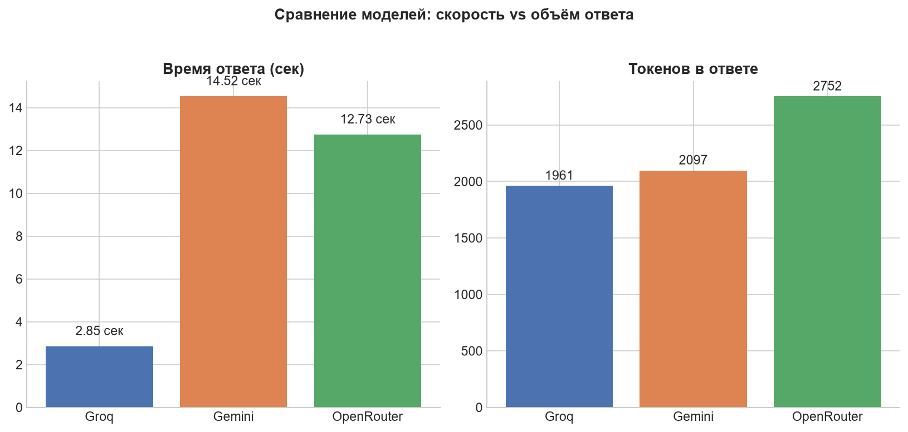

# AI Agentic Labs

Лабораторные по курсу AI Agents for Enterprise Process Automation.

## Lab 1: Comparing LLMs (Groq, Gemini, OpenRouter)

Prompt used for every model: *"Explain the difference between machine learning and LLMs"* (sent in Russian).

| Platform | Model | Time (sec) | Tokens | Notes |
|---|---|---|---|---|
| Groq | `openai/gpt-oss-20b` | 2.85 | 1961 | Fastest, no failures |
| Gemini | `gemini-3.6-flash` | 14.52 | 2097 | Slowest, occasional 503 overload errors |
| OpenRouter | `openrouter/free` | 12.73 | 2752 | Longest answer |



**Conclusion:** Groq was the fastest at 2.85 s, roughly 4.5–5 times quicker than OpenRouter and Gemini on the same prompt. Two model IDs from the course examples had already stopped working (`llama-3.1-8b-instant`, `gemini-2.5-flash`), so current replacements were used instead.

## Lab 2: Structured extraction (Pydantic + instructor)

*In progress.*

## Setup

```bash
pip install -r requirements.txt
```
Copy `.env.example` to `.env` and fill in your keys (`GROQ_API_KEY`, `GOOGLE_API_KEY`, `OPENROUTER_API_KEY`).
